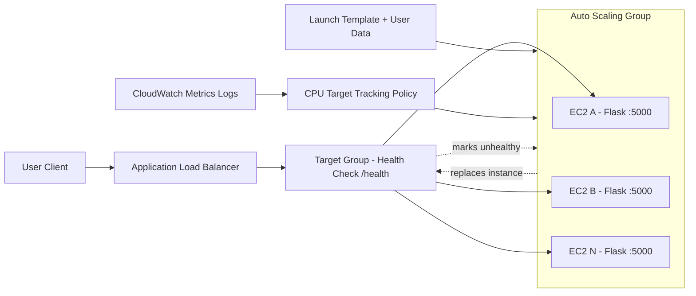

# AWS Self-Healing Infrastructure on AWS (Terraform + State Reconciliation)

I built this project to learn how real systems recover from failures without manual intervention. It started small, then gradually moved to a more production-style setup with ALB, ASG, and Terraform.

## Project overview

This project evolved in 3 phases:

1. Lambda-first: automatic recovery for failed EC2 instances.
2. ALB + ASG migration: health-based routing and automatic instance replacement.
3. Terraform migration: imported existing AWS resources and reconciled state/drift.

End result: a self-healing setup that is easier to scale, easier to manage, and closer to how teams run infra in production.

## Real-world use cases

- E-commerce platforms handling sudden traffic spikes during sales.
- SaaS products that require continuous availability for customer dashboards and APIs.
- Startup teams reducing manual incident handling through automated recovery.
- DevOps learning portfolios demonstrating high availability, scaling, and IaC migration skills.

## Why this project matters

Most tutorials show only greenfield setups. In real work, we often need to migrate existing running infrastructure without breaking it.

That is why this project focuses on:

- moving from a basic Lambda-first model to ALB + ASG
- introducing CPU-based auto scaling
- importing existing AWS resources into Terraform state
- fixing drift safely instead of recreating everything

## Tech stack

| Area | Tools |
| --- | --- |
| Cloud | AWS (EC2, ALB, Target Group, ASG, CloudWatch, SNS, Lambda) |
| IaC | Terraform |
| App | Python (Flask) |
| OS | Amazon Linux |

## Final architecture

### Request flow

User -> ALB -> Target Group (/health) -> Auto Scaling Group -> EC2 instances -> Flask app

### Architecture diagram



## Demo and Screenshots

### Demo link

- Demo video (optional): [Add your video link here](https://your-video-link-here)

### Screenshots

- Architecture overview

       

- ALB Target Group health

       

- Auto Scaling activity

       

- Self-healing proof (old instance replaced by new instance)

       

- Terraform state reconciliation proof

       

## Migration journey

### Phase 1: Lambda-first setup

I initially used a Lambda-based recovery flow (CloudWatch -> SNS -> Lambda) to replace unhealthy EC2 instances.

Why move beyond Lambda for this use case:

- Needed stronger control over web traffic routing.
- Needed built-in health-based lifecycle management.
- Needed cleaner scale-out behavior during load spikes.

### Phase 2: Move to EC2 + ALB + ASG

Then I moved to EC2 instances managed by ASG and fronted by ALB.

Key outcomes of this phase:

- Health checks on /health endpoint.
- ALB routes traffic only to healthy instances.
- Unhealthy instances are removed from target group traffic, terminated by ASG, and automatically replaced.
- User data script provisions instances on boot and starts the Flask app.
- Attached a target-tracking inline scaling policy on ASG based on CPU utilization.
- When CPU increases, ASG launches new instances and ALB starts routing traffic to healthy new targets.

### Phase 3: Full Terraform adoption

After validating everything manually in AWS, I moved the setup to Terraform for repeatable and version-controlled changes.

Benefits achieved:

- Infra changes tracked in code.
- Safer updates with plan before apply.
- Less manual console work.

## Infrastructure State Reconciliation

This was the most important learning part for me: managing already-running AWS resources through Terraform without rebuilding from scratch.

### Step 1: Define Terraform resources to match live AWS

Created and refined:

- terraform/provider.tf
- terraform/main.tf
- user-data/userdata.sh

Goal: ensure Terraform resource blocks accurately represent resources already running in AWS.

### Step 2: Import existing AWS resources into state

Imported real resources instead of recreating them:

- Security Groups
- Launch Template
- Target Group
- Application Load Balancer
- Auto Scaling Group

Example pattern:

```bash
terraform import <terraform_resource_address> <aws_resource_id>
```

### Step 3: Resolve plan conflicts

After import, I fixed mismatches between code and cloud:

- Removed duplicate definitions.
- Corrected provider/resource arguments.
- Aligned naming and references.
- Re-ran terraform plan until changes were intentional and understood.

### Step 4: Correct drift (critical fix)

Main drift issue found:

- ASG was still linked to an old Launch Template version.

Fix applied:

- Updated Terraform configuration and replaced/updated ASG behavior so new instances came from the latest template.

Result:

- New instances launched with the expected user data and configuration.

### Step 5: Stabilize state management

- Maintained a clean Terraform state lifecycle.
- Used plan + apply discipline to avoid accidental replacement.
- Ensured state now reflects real infrastructure.

## Self-healing behavior summary

When an app process fails on an instance:

1. ALB health check fails.
2. Target is marked unhealthy and removed from traffic.
3. ASG terminates unhealthy instance.
4. ASG launches replacement instance automatically.
5. New instance boots from user data and joins the target group.

## Traffic spike handling with CPU policy

- ASG uses a CPU utilization target-tracking inline policy.
- During traffic spikes, higher CPU triggers scale-out and additional EC2 instances are launched.
- ALB distributes traffic to healthy targets, including newly launched instances.

## Deployment workflow

```bash
# from terraform directory
terraform init
terraform validate
terraform plan
terraform apply
```

For imported infrastructure:

```bash
terraform import <terraform_resource_address> <aws_resource_id>
terraform plan
```

## Test the self-healing flow

```bash
# connect to an instance
ssh -i your-key.pem ec2-user@<instance-ip>

# simulate app failure
pkill -f flask
```

Expected result:

- Instance becomes unhealthy.
- ALB stops routing traffic to it.
- ASG replaces it with a new healthy instance.

## Repository structure

```text
.
|-- LICENSE
|-- README.md
|-- docs/
|   |-- Setup_steps.md
|   |-- launch_templates.md
|   |-- project_overview.md
|   `-- real_world_usecase.md
|-- lambda/
|   |-- lambda_function_basic.py
|   `-- lambda_function_debug.py
|-- terraform/
|   |-- main.tf
|   `-- provider.tf
`-- user-data/
    `-- userdata.sh
```

## Learning outcomes

- Built and tested a highly available setup with ALB + ASG.
- Implemented health-based self-healing on EC2.
- Learned Terraform import and state reconciliation on real resources.
- Practiced moving from manual setup to IaC.

## Best practices followed

- Do not commit terraform.tfstate files.
- Restrict SSH access and minimize open ports.
- Apply least-privilege IAM permissions.
- Always review terraform plan before terraform apply.

## Author

Harshit Rastogi  
B.Tech 3rd Year, USICT Dwarka  
DevOps and Cloud Engineer
