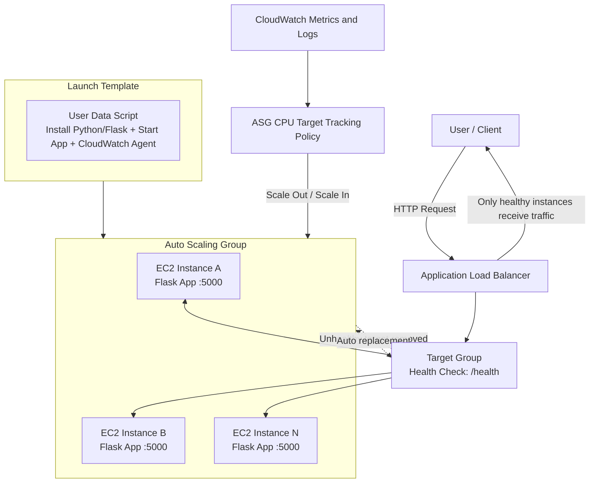

# AWS Self-Healing Infrastructure on AWS (Terraform + State Reconciliation)

Production-style self-healing setup on AWS with Auto Scaling, Load Balancing, health checks, and Terraform-based lifecycle management.

## Project overview

This project demonstrates the evolution of a cloud reliability system in three practical phases:

1. Lambda-first automated recovery for failed EC2 workloads.
2. Migration to ALB + ASG for health-based traffic routing and automatic replacement.
3. Full Terraform adoption with Infrastructure State Reconciliation (ADVANCED) to import and manage existing AWS resources safely.

The final result is a production-style, self-healing architecture that improves uptime, scaling behavior, and operational consistency.

## Real-world use cases

- E-commerce platforms handling sudden traffic spikes during sales.
- SaaS products that require continuous availability for customer dashboards and APIs.
- Startup teams reducing manual incident handling through automated recovery.
- DevOps learning portfolios demonstrating high availability, scaling, and IaC migration skills.

## Why this project matters

This project is not just about creating cloud resources. It demonstrates a complete infrastructure evolution:

1. Initial architecture with a Lambda-first approach.
2. Migration to EC2 + ALB + Auto Scaling Group for better control and scale.
3. Final migration to Terraform with imported AWS resources and state reconciliation.

This is the same type of migration path many real teams follow when moving from rapid prototyping to production-ready infrastructure.

## Tech stack

| Area | Tools |
| --- | --- |
| Cloud | AWS (EC2, ALB, Target Group, ASG, CloudWatch, SNS, Lambda) |
| IaC | Terraform |
| App | Python (Flask) |
| OS | Amazon Linux |

## Final architecture

### Request flow

User -> ALB -> Target Group (/health) -> Auto Scaling Group -> EC2 instances -> Flask app

### Architecture diagram



## Demo and Screenshots

### Demo link

- Live demo: [Add your demo URL here](https://your-demo-link-here)
- Demo video (optional): [Add your video link here](https://your-video-link-here)

### Screenshots

- Architecture overview

       

- ALB Target Group health

       

- Auto Scaling activity

       

- Self-healing proof (old instance replaced by new instance)

       

- Terraform state reconciliation proof

       

## Migration journey

### Phase 1: Lambda-first setup

The project started with a Lambda-based design for lightweight compute and quick setup.

Why move beyond Lambda for this use case:

- Needed persistent application runtime behavior.
- Needed fine-grained control over instance health and process-level recovery.
- Needed predictable scaling behavior for web traffic behind a load balancer.

### Phase 2: Move to EC2 + ALB + ASG

I migrated the runtime from Lambda to EC2 instances managed by an ASG and fronted by an ALB.

Key outcomes of this phase:

- Health checks on /health endpoint.
- ALB routes traffic only to healthy instances.
- Unhealthy instances are removed from target group traffic, terminated by ASG, and automatically replaced.
- User data script provisions instances on boot and starts the Flask app.
- Attached a target-tracking inline scaling policy on ASG based on CPU utilization.
- When CPU load increases, ASG launches new instances to handle traffic, and ALB automatically diverts requests across healthy instances.

### Phase 3: Full Terraform adoption

After validating the architecture manually in AWS, I moved the complete setup to Terraform for repeatable and version-controlled infrastructure.

Benefits achieved:

- Infra changes tracked in code and git history.
- Safer updates through plan-before-apply workflow.
- Reduced manual drift and click-ops.

## Infrastructure State Reconciliation (ADVANCED)

This is the strongest part of the project: importing existing live AWS infrastructure into Terraform state and reconciling drift safely.

### Step 1: Define Terraform resources to match live AWS

Created and refined:

- terraform/provider.tf
- terraform/main.tf
- user-data/userdata.sh

Goal: ensure Terraform resource blocks accurately represent resources already running in AWS.

### Step 2: Import existing AWS resources into state

Imported real resources instead of recreating them:

- Security Groups
- Launch Template
- Target Group
- Application Load Balancer
- Auto Scaling Group

Example pattern:

```bash
terraform import <terraform_resource_address> <aws_resource_id>
```

### Step 3: Resolve plan conflicts

After import, I fixed mismatches between code and cloud:

- Removed duplicate definitions.
- Corrected provider/resource arguments.
- Aligned naming and references.
- Re-ran terraform plan until changes were intentional and understood.

### Step 4: Correct drift (critical fix)

Main drift issue found:

- ASG was still linked to an old Launch Template version.

Fix applied:

- Updated Terraform configuration and replaced/updated ASG behavior so new instances came from the latest template.

Result:

- New instances launched with the expected user data and configuration.

### Step 5: Stabilize state management

- Maintained a clean Terraform state lifecycle.
- Used plan + apply discipline to avoid accidental replacement.
- Ensured state now reflects real infrastructure.

## Self-healing behavior summary

When an app process fails on an instance:

1. ALB health check fails.
2. Target is marked unhealthy and removed from traffic.
3. ASG terminates unhealthy instance.
4. ASG launches replacement instance automatically.
5. New instance boots via user data and rejoins target group.

## Traffic spike handling with CPU policy

- ASG uses a CPU utilization target-tracking inline policy.
- During traffic spikes, higher CPU triggers scale-out and additional EC2 instances are launched.
- ALB continuously distributes traffic to all healthy targets, including newly launched instances, to keep response performance stable.

## Deployment workflow

```bash
# from terraform directory
terraform init
terraform validate
terraform plan
terraform apply
```

For imported infrastructure:

```bash
terraform import <terraform_resource_address> <aws_resource_id>
terraform plan
```

## Test the self-healing flow

```bash
# connect to an instance
ssh -i your-key.pem ec2-user@<instance-ip>

# simulate app failure
pkill -f flask
```

Expected result:

- Instance becomes unhealthy.
- ALB stops routing traffic to it.
- ASG replaces it with a new healthy instance.

## Repository structure

```text
.
|-- LICENSE
|-- README.md
|-- docs/
|   |-- Setup_steps.md
|   |-- launch_templates.md
|   |-- project_overview.md
|   `-- real_world_usecase.md
|-- lambda/
|   |-- lambda_function_basic.py
|   `-- lambda_function_debug.py
|-- terraform/
|   |-- main.tf
|   `-- provider.tf
`-- user-data/
    `-- userdata.sh
```

## Learning outcomes

- Designed highly available AWS architecture with ALB + ASG.
- Implemented health-based self-healing on EC2.
- Practiced real-world Terraform import and state reconciliation.
- Migrated from prototype-style infrastructure to production-style IaC.

## Best practices followed

- Do not commit terraform.tfstate files.
- Restrict SSH access and minimize open ports.
- Apply least-privilege IAM permissions.
- Always review terraform plan before terraform apply.

## Author

Harshit Rastogi  
B.Tech 3rd Year, USICT Dwarka  
Aspiring DevOps and Cloud Engineer
