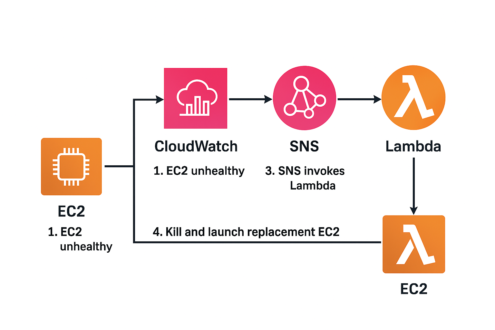

# AWS EC2 Self-Healing with Lambda (Lambda-Only Phase)

This document covers the Lambda-only version of the self-healing project, before the ALB + ASG migration.

## Overview

In this phase, EC2 recovery is event-driven:

CloudWatch Alarm -> SNS Topic -> Lambda Function -> Launch New EC2 -> Reattach Elastic IP -> Terminate Old EC2 -> SNS Notification

If an EC2 instance becomes unhealthy, Lambda automatically replaces it.

## Files in this folder

- lambda_function_basic.py
  - Production-style flow with direct SNS event parsing.
- lambda_function_debug.py
  - Same flow with extra logs and safer instance-id parsing for debugging/manual testing.

## How it works

1. CloudWatch alarm detects EC2 health failure.
2. Alarm publishes to SNS topic.
3. SNS triggers Lambda.
4. Lambda reads failed instance id from SNS alarm message.
5. Lambda launches a replacement EC2 instance using configured AMI/subnet/security group/key pair.
6. Lambda waits for replacement instance to be running.
7. Lambda tags the new instance for traceability.
8. Lambda reattaches Elastic IP (if EIP allocation id is provided).
9. Lambda terminates the failed instance.
10. Lambda sends final SNS notification with old and new instance ids.

## Required AWS services

- Amazon EC2
- Amazon CloudWatch
- Amazon SNS
- AWS Lambda
- IAM

## Lambda environment variables

Set these in Lambda configuration:

- SNS_TOPIC_ARN
  - ARN of topic used for final notification publish.
- AMI_ID
  - AMI for replacement instance.
- INSTANCE_TYPE
  - Example: t2.micro.
- SUBNET_ID
  - Subnet where replacement instance should launch.
- SEC_GROUP
  - Security group id for replacement instance.
- KEY_NAME
  - Existing EC2 key pair name.
- EIP_ALLOCATION_ID
  - Optional allocation id to keep public endpoint stable.
- DEMO_MODE
  - true or false. Default is true.
  - true: only logs action, does not launch/terminate.
  - false: executes full replacement flow.

## IAM permissions for Lambda role

Minimum actions needed:

- ec2:RunInstances
- ec2:TerminateInstances
- ec2:DescribeInstances
- ec2:CreateTags
- ec2:AssociateAddress
- ec2:DescribeAddresses
- sns:Publish
- logs:CreateLogGroup
- logs:CreateLogStream
- logs:PutLogEvents

You can scope resources tighter for production security.

## CloudWatch alarm setup guidance

Use EC2 status-check metrics such as:

- StatusCheckFailed_Instance
- StatusCheckFailed_System

Send alarm action to SNS topic that is configured as Lambda trigger.

## Deployment steps

1. Create SNS topic for alarm trigger.
2. Create Lambda function (Python runtime).
3. Paste lambda_function_basic.py or lambda_function_debug.py code.
4. Configure environment variables.
5. Attach IAM role with required permissions.
6. Add SNS trigger to Lambda.
7. Create CloudWatch alarm for instance health and route alarm to SNS topic.
8. Start with DEMO_MODE=true and validate logs first.
9. Switch DEMO_MODE=false to enable real replacement.

## Testing

### Safe dry run (recommended first)

- Keep DEMO_MODE=true.
- Trigger Lambda with a sample SNS event.
- Confirm logs show: [DEMO] Would replace <instance_id>.

### Real run

- Set DEMO_MODE=false.
- Trigger alarm on a test instance or force a failure scenario.
- Verify:
  - New instance launched.
  - Elastic IP moved (if configured).
  - Old instance terminated.
  - SNS notification sent.

## Common mistakes to avoid

1. Leaving DEMO_MODE=true and expecting real replacement.
2. Using wrong SEC_GROUP, SUBNET_ID, or KEY_NAME values.
3. Missing IAM permissions for EC2 or SNS actions.
4. Not attaching Lambda trigger to the correct SNS topic.
5. Alarm dimension parsing mismatch in custom alarm payloads.
6. Not providing EIP_ALLOCATION_ID when stable public IP is required.
7. Testing in production account without a dedicated test instance.

## Basic vs Debug script

Use lambda_function_basic.py when alarm payload format is stable.

Use lambda_function_debug.py when:

- You need verbose logs.
- You want safer payload parsing.
- You want easier manual-event testing fallback behavior.

## Notes

This Lambda-only phase is excellent for event-driven self-healing demonstrations.

For higher-scale web traffic and native health-based load routing, migrate to ALB + ASG architecture and then Terraform state-managed infrastructure.

---

## Project Structure Diagram

---

## Screenshots

- CloudWatch Alarm

  

- SNS Subscription Email

  

- Lambda Logs (showing termination and new instance ID)

  

- EC2 Dashboard showing new instance

  

---